# 📱 Motorola Edge 50 Ultra  
## Photography & Videography Starter Guide

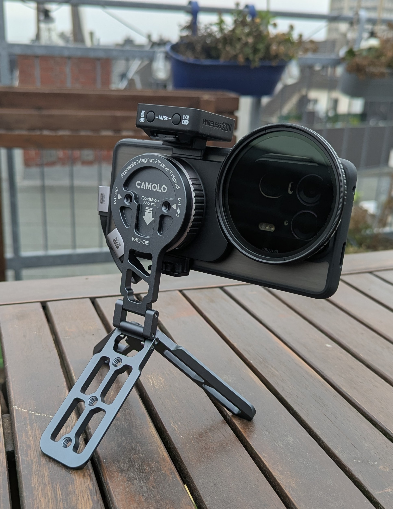

---

## Why this guide exists

This guide has three main goals:

1. **Collecting practical best practices**  
    While working with the Motorola Edge 50 Ultra over an extended period of time, I identified settings, workflows, and recording strategies that consistently produce better video results. This guide documents those findings in a structured and reproducible way.

2. **Focusing on video quality rather than convenience**  
    The intended audience of this guide are users who primarily record video and aim to maximize technical image quality. This includes aspects such as dynamic range, bit depth, codec efficiency, and overall recording stability. Automatic processing and instant shareability are intentionally not the focus of this guide.

3. **Assuming post-processing as part of the workflow**  
   All recommendations assume that recorded footage will be post-processed on a PC or Mac.  
   Topics such as color correction, grading, and proper export settings are considered an integral part of the workflow, not an optional step.

This guide is written for users who prefer **control and predictability** over fully automated results.

---

## 📋 Device Overview & Specs

This section merges multiple spec sources to provide a broad, global view of the Motorola Edge 50 Ultra. Where sources disagree (region variants / measurement differences), values are kept and noted.

**Identity / Names**
- Brand: Motorola
- Model: Edge 50 Ultra (also known as X50 Ultra)
- UI / Skin: Hello UX / Hello UI

**Body / Build**
- Dimensions: 161.1 × 72.4 × 8.6 mm  
- Weight: 197 g (6.95 oz)
- Volume (approx.): 100.31 cm³ (6.09 in³)
- Frame: metal / aluminum (sandblasted aluminum / aluminum alloy)
- Front: Gorilla Glass Victus
- Back (variant-dependent): wood / eco-leather / vegan leather
- Ingress protection: IP68 (dust-tight; water resistant up to 1.5 m for 30 min)
- Cooling: vapor chamber

**Display**
- Technology: pOLED
- Size: 6.7 inches  
- Resolution: 2712 × 1220 (Super HD, ~446 ppi)
- Aspect ratio: 20:9  
- Color depth: 10-bit  
- Refresh rate: adaptive (60–144 Hz)
- Touch sampling: up to 360 Hz
- Peak brightness measured: 1466 nits
- HDR: HDR10+
- Color space: 100% DCI-P3
- Protection: Gorilla Glass Victus
- Screen-to-body / screen area (kept as variants): 93.8% (AA-TP) / 92.37% / 92.9%

**Certifications**
- HDR10+, Amazon HD Streaming, Netflix HD Streaming
- SGS Low Blue Light, SGS Low Motion Blur
- Pantone Validated Color, Pantone SkinTone Validated

**Platform / Performance**
- OS: Android 15
- Upgrade info: upgradable to Android 16 (“currently in rollout state”)
- SoC: Qualcomm Snapdragon 8s Gen 3 (SM8635, 4 nm; TSMC)
- CPU: 1× 3.0 GHz Cortex-X4 + 4× 2.8 GHz Cortex-A720 + 3× 2.0 GHz Cortex-A520
- CPU ISA / bitness: ARMv9-A, 64-bit
- L3 cache: 8 MB
- GPU: Adreno 735  
  - GPU shading units: 768
  - GPU clock: 1100 MHz
  - FLOPS: ~1689.6 GFLOPS
- NPU / AI: Qualcomm Hexagon NPU

**Memory**
- RAM size: 16 GB
- RAM type: LPDDR5X
- RAM clock: 4266 MHz
- Channels: quad-channel
- RAM Boost: supported

**Storage**
- Internal storage: 1 TB
- Storage type: UFS 4.0
- Card slot: none
- OS size: 74 GB

**Camera (rear hardware)**
- Main: 50 MP, f/1.6, 23 mm; 1/1.3"; 1.2 µm (Quad Pixel 2.4 µm); omnidirectional PDAF; OIS  
  - Sensor model: OmniVision OV50H (OVH9000)
- Ultra-wide / Macro: 50 MP, f/2.0, 13 mm, 122° FoV; 1/2.76"; 0.64 µm (Quad Pixel 1.28 µm); AF  
  - Sensor model: Samsung S5KJN1  
- Telephoto: 64 MP, f/2.4, 71 mm; 1/2.0; 3× optical zoom; PDAF; OIS  
  - Sensor model: OmniVision OV64B

**Camera (rear video recording)**
- 4K UHD: 30 / 60 fps
- 1080p: 30 / 60 / 120 / 240 / 960 fps
- 10-bit HDR10+: 4K HDR10+ @ 30 fps; 1080p HDR10+ @ 60 fps

**Camera (front)**
- Front: 50 MP, f/1.9, 21 mm; 0.64 µm (Quad Pixel 1.28 µm)  
  - Photo resolution listed as 8192 × 6144 / 8120 × 6180 (variants kept)  
  - Sensor model: Samsung JNS  
  - Autofocus: PDAF
  - Stabilization: digital
- Front video: 4K 30/60 fps; 1080p 30/60/120 fps; slow motion 1080p 120 fps, 720p 240 fps

**Audio**
- Stereo speakers
- Microphones: 3
- Dolby Atmos (and Dolby Head Tracking)
- Snapdragon Sound
- Active noise cancellation with three microphones
- 3.5 mm jack: No (only USB-C audio)

**Connectivity**
- SIM: Nano-SIM + eSIM  
- Wi-Fi: 802.11 a/b/g/n/ac/ax (Wi-Fi 6E) + Wi-Fi 7 (802.11be)  
  - Tri-band (2.4/5/6 GHz)
  - Wi-Fi MIMO, Wi-Fi Direct, Wi-Fi Hotspot, Wi-Fi Display
- Bluetooth: 5.4 (profiles listed: A2DP, LE)
- NFC: Yes
- UWB: Yes
- USB: USB-C, USB 3.1 Gen 2; charging, USB storage mode, OTG; DisplayPort 1.4 Alt Mode
- Positioning: GPS, A-GPS, GLONASS, Galileo, BeiDou, NavIC, QZSS, LTEPP, SUPL
- LTE Cat: 18

**Cellular bands**
- 2G (GSM): 850/900/1800/1900
- 3G (UMTS/WCDMA/HSDPA): 850/900/1700(AWS)/1900/2100
- 4G (LTE): 1,2,3,4,5,7,8,12,13,17,18,19,20,25,26,28,32,38,39,40,41,42,43,66  
- 5G : n1/2/3/5/7/8/20/26/28/38/40/41/66/71/75/77/78

**Battery**
- Capacity: 4500 mAh
- Type: Li-Polymer
- Charging: 125 W wired, 50 W wireless, 10 W reverse wireless
- Adapter output (as listed): 10 V / 12.5 A
- Bundled charger: Yes, 125 W

**Sensors**
- Proximity sensor, ambient light sensor (front-facing)
- 3-in-1 sensor (exposure, automatic white balance, flicker detection)
- Accelerometer, gyroscope, magnetometer/compass, SAR sensor
- Under-display fingerprint sensor (optical)
- X-axis linear motor (haptics)

**Security / System Features**
- Under-display fingerprint sensor, Face Unlock
- ThinkShield, Moto Secure

**Benchmarks / Scores / Tests**
- NanoReview score: 81 (Display 88 / Camera 89 / Performance 74 / Gaming 71 / Battery 75 / Connectivity 87)
- DxOMark (main camera): Photo 150 / Video 134 / Overall 146; Zoom 147 / Bokeh 80 / Preview 77
- Geekbench 6: single-core 1945; multi-core 5163
- Geekbench Compute (GPU): 9946
- AnTuTu v10: 1,565,552 (CPU 390,171 / GPU 540,712 / MEM 366,039 / UX 268,630)
- AnTuTu v11, 1,890,332
- Display peak brightness test: 1466 nits; PWM 239 Hz; response time 2 ms; contrast ∞ (infinite)
- Charging/battery tests: 81% in 15 min; full charge ~0:21 hr; web 08:41 hr; video 15:30 hr; gaming 05:36 hr; standby 102 hr; general 22:32 hr

---

### Chapter 2 – Rooting: required or optional?

In my view, rooting the Motorola Edge 50 Ultra is a requirement if the device is intended to be used for serious video or RAW workflows. Without root access, system-level limitations directly affect recording stability, storage throughput, and sensor behavior, and these issues cannot be reliably solved at the application level.

The most critical limitation on a stock system is **recording stability under sustained load**. When using MotoCam, MotionCam Pro, or mcpro24fps, the device heats up after a few minutes and the SoC begins to throttle aggressively. In practice, this often results in **dropped frames once thermal limits are reached**, which immediately compromises the usability of a video clip.

With root access, **tools such as Camera Watchdog can intervene at the system level**. Instead of allowing the SoC to boost until thermal limits are exceeded, the CPU frequency is capped to a level that is fully sufficient for video encoding and image processing. This prevents critical temperatures from being reached in the first place and keeps the system in a stable operating state. As a result, **thermal throttling is effectively avoided and frame drops are eliminated** in scenarios that would otherwise fail on a stock system.

The second major limitation without root is **storage throughput**. When no USB connection is present, the internal storage controller is downclocked to 100 MHz, limiting sustained write speeds to about 180–220 MB/s. While this is adequate for Direct Log recording, it becomes a hard bottleneck for RAW video. With root access, Camera Watchdog can keep the storage clock at around 403 MHz during camera app usage, enabling **sustained write speeds above 500 MB/s**, which is a prerequisite for reliable RAW video recording.

Thermal behavior is closely tied to both stability and storage performance. The Edge 50 Ultra uses more than 60 thermal sensors, some of which are positioned in areas that are difficult to cool effectively, even with external cooling solutions such as Peltier elements. As a result, thermal throttling may trigger even when CPU, GPU, and battery temperatures remain within safe limits. Root access allows **much finer control over thermal management** and, in extreme cases, makes it possible to disable thermal throttling entirely. This is only relevant for **highly experimental configurations**, such as 4K at 120 fps or 8K at 30 fps, both of which require additional modifications.

A direct consequence of controlled CPU behavior is improved energy efficiency. By preventing unnecessary boosting, **power consumption during video recording is reduced by roughly 15–20 %**, which in practice can result in up to 20 % longer recording times per battery charge. This is particularly relevant for long takes or field use.

One of the strongest feature-level arguments for rooting the device is **access to Dual Conversion Gain (DCG)**. DCG is a sensor-level technology that allows the camera sensor to operate in different gain configurations depending on the shooting scenario. This makes it possible to optimize the balance between dynamic range and noise performance instead of relying on a single fixed behavior.

On a stock system, access to these DCG modes is limited to MotoCam only. With root access, **DCG can be explicitly enabled for all 3rd party apps**, allowing the sensor to operate in modes that provide cleaner shadows and better highlight handling. 

Root access also enables the use of camera modifications that unlock recording modes not available through the stock camera app or standard third-party applications. While not all of these modes are publicly available at the time of writing, the following configurations are technically possible:

- RAW10 recording at 8K @ 24 fps  
- RAW10 recording at 8K @ 30 fps  
- RAW10 recording at 4K @ 120 fps  
- RAW recording with DCG at 4K @ 60 fps  
- RAW10 recording at 4.6K @ 60 fps  
- Explicit unlocking and forcing of DCG modes  
- Recording in DCG8, with DCG4 offering approximately two-thirds of a stop better dynamic range and noise performance compared to standard modes  

In summary, without root the Motorola Edge 50 Ultra is a capable camera smartphone. With root access, it becomes **a predictable, thermally stable system with sufficient storage throughput for RAW workflows and direct control over sensor behavior**. For users who rely on stable, high-quality video or RAW recording, rooting the device is, in my experience, difficult to avoid.

---

### Chapter 3 – How to root the Motorola Edge 50 Ultra

- Unlock Bootloader: https://www.youtube.com/watch?v=nA31QdYu4Ek
- Root Phone: https://www.youtube.com/watch?v=sqV8FwOijLs
    - Instead of using Magisk as described I would recommend to use KernelSU Next v3.0.0
    - The procedure is exactly the same
- Fixing Playstore Integrity: https://xdaforums.com/t/a-guide-to-fixing-play-integrity-with-kernelsu.4759925/
- Recommended Modules:
    - Zygisk-Next
    - Tricky-Store
    - TrickyAddonModule
    - PlayIntegrityFork
    - DeviceID-Changer

---

### Chapter 4 – Recommended Software

#### Apps

- **Google Camera** - I recommend using **AGC9.2.14_V14.0_meitu** together with the **MotoX50Ultra_AGC9.2v2** and **JoqZ92v4rc14** libraries. In this configuration, all lenses are detected correctly and behave as expected. The ISP influence is reduced to a minimum, resulting in a more neutral, DSLR-like image without excessive computational processing or artificial sharpening. HDR and HDR+ work reliably, and all special modes such as Slow Motion, Timelapse, Panorama, and others are available. This is also the only GCam version I have tested where **2× sensor zoom works correctly across all lenses**. Autofocus performs reliably, including focus tracking, and the built-in video mode allows recording up to **4K at 60 fps** with the ability to switch lenses on the fly.
- **mcpro24fps** is my preferred app when recording DCG in DirectLog. With the appropriate mods, it allows recording at **4.6K 60 fps in Log at 250 Mb/s**, while maintaining stable encoder behavior. For me, as a professional, every minute saved in post-production matters, so my goal is to minimize post-processing effort as much as possible. Recording in Log preserves the most relevant parts of the RAW signal while still producing video files that are efficient and predictable to work with in post-production. Combined with Camera Watchdog, this setup allows recording **hours of footage without dropped frames**, even under sustained load.
- **MotionCam Pro** is my preferred app when recording in RAW. With the appropriate mods, it allows recording at **8K 30 fps** or **4K 100 fps**. Unlike most camera apps, MotionCam does not rely on the SoC’s ISP, which gives it full control over the image processing pipeline. This approach comes at a cost: MotionCam is significantly more resource-intensive and consumes noticeably more power compared to mcpro24fps. If you are aiming for absolute maximum image quality and are comfortable working with very large files (for example, **more than 1 GB for 5 seconds of footage**), MotionCam is capable of delivering the best results the sensor can produce.
- **Mod Tile Manager (MTM)** is a tool that allows camera-related modules and settings to be enabled or disabled on the fly. Unlike KernelSU modules, which are injected at boot time, MTM can inject modules dynamically while the system is running. This makes it possible to activate or deactivate camera modules without rebooting the device, which is especially useful when switching between different recording modes or workflows.
- **DeviceInfoOverlay** is a lightweight overlay app that displays real-time performance metrics on top of other apps, such as CPU frequency, RAM usage, battery level and voltage, and system load. It can show CPU and GPU load/frequency, refresh rate, network traffic, and other live data over any running app, with customizable transparency and layout.

#### KernelSU Modules

- **Camera Watchdog** is a KernelSU module designed to improve recording stability when using demanding camera apps such as MotionCam or mcpro24fps. It automatically detects active camera apps and temporarily switches the device into a dedicated recording performance state, optimizing CPU, GPU, memory, storage I/O, and process priorities to prevent dropped frames. The goal is not higher peak performance, but predictable, sustained throughput for long, high-bitrate video recordings under real-world thermal constraints.
- **Performance Motorola50Ultra** is a performance-focused KernelSU module intended for maximum camera throughput. It locks UFS at 403 MHz, increases DDR frequency to 2736 MHz, optimizes memory writeback to avoid stalls, and boosts L3/LLCC behavior, targeting significantly higher sustained performance during recording. This variant is designed for advanced users only, as it prioritizes throughput over thermals and can be used to extend recording sessions of some camera modules that unlock modes that are out of spec.

#### MTM Tiles

This is a list of all camera-related modules currently installed in ModuleTileManager on my device. Some of these modules are **not publicly available** at the time of writing and may or may not be released in the future. This section should be considered **documentation of my current setup only**. I will not answer questions regarding sources, availability, or release timelines. As long as the respective authors have not released these modules publicly, I will not share them or link to them.

- **4.6K60p** - Enables 4.6K recording at 60 fps with DCG active across all camera apps.

- **4K100p** - Enables 4K recording at 100 fps in MotionCam.

- **4K120p** - Enables 4K recording at 120 fps across all camera apps.

- **8K24p** - Enables 8K recording at 24 fps in MotionCam.

- **8K30p** - Enables 8K recording at 30 fps in MotionCam.

- **DCG2** - A DCG variant using alternative gain tables and fixed white balance. It provides less dynamic range than DCG4 but is more practical and predictable in controlled studio environments.

- **DCG4** - Forces the sensor to operate in DCG mode across all camera apps.

- **DCG8** - A DCG variant that extends dynamic range compared to traditional DCG operation.

### Chapter 5 – Recommended Hardware

- **[Case](https://s.click.aliexpress.com/e/_c3uoW7ZB)** - This case forms the foundation of my smartphone setup. In addition to basic protection, it integrates a **MagSafe-compatible ring**, which allows magnetic accessories to be attached securely. For my workflow, it is essential to be able to assemble and disassemble a setup within seconds, which is why I strongly prefer **quick-mount solutions**. Unlike many other cases, the MagSafe ring is **embedded inside the case** rather than glued onto the surface. This prevents the ring from scratching in pockets and avoids lint or dust accumulation around the magnet. Another practical design detail is that the case converts the rounded camera bump into a **more squared-off shape**, which makes it significantly easier to mount and align camera-related accessories.

    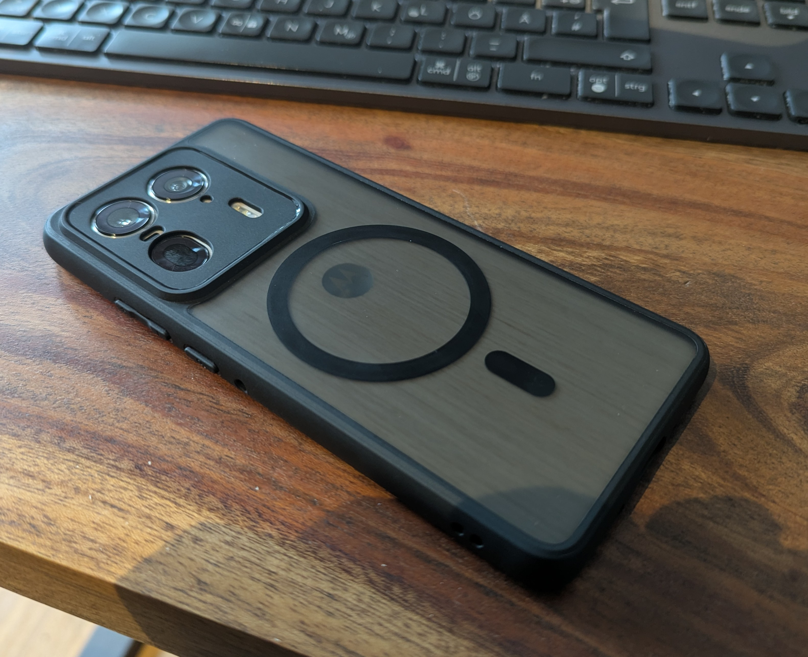

- **[Lens Filter Adapter](https://s.click.aliexpress.com/e/_c4MYODYV)** (*optional* but **recommended**)
  If you frequently shoot outdoors — especially landscapes, panoramas, or scenes with a bright sky—the fixed aperture of a smartphone camera quickly becomes a limitation. The main lens is a fixed focal length with a fixed aperture, which means it cannot be stopped down when the sky becomes too bright. The result is clipped highlights and blown-out skies.

  Most modern smartphone camera apps hide this problem using heavy ISP processing and AI-based sky reconstruction. When recording with mcpro24fps or MotionCam, these computational features are intentionally avoided, which means exposure has to be controlled optically instead. On a DSLR, this would be done by stopping down the lens, but on a smartphone this is not possible without additional hardware.

  This adapter allows ND filters (e.g. ND2) to be mounted in front of the lens, effectively giving you **manual exposure control**, similar to working with a traditional camera lens. With the filter in place, highlights can be preserved and skies no longer clip.

  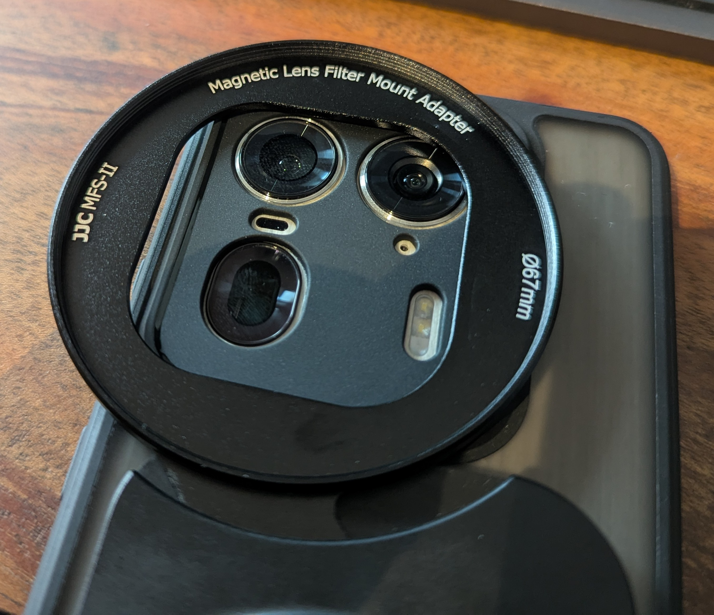

  The lens filter adapter was originally designed for iPhones but works well on the Motorola Edge 50 Ultra. When used with the recommended case, the TPU ring can be removed, as the case itself prevents stray light from entering between the filter and the lens.

  There is one limitation: the main camera and telephoto camera are fully compatible out of the box, but the adapter slightly intrudes into the field of view of the ultra-wide camera. This can be resolved with minor modification (for example, a few minutes with a file or rotary tool).

  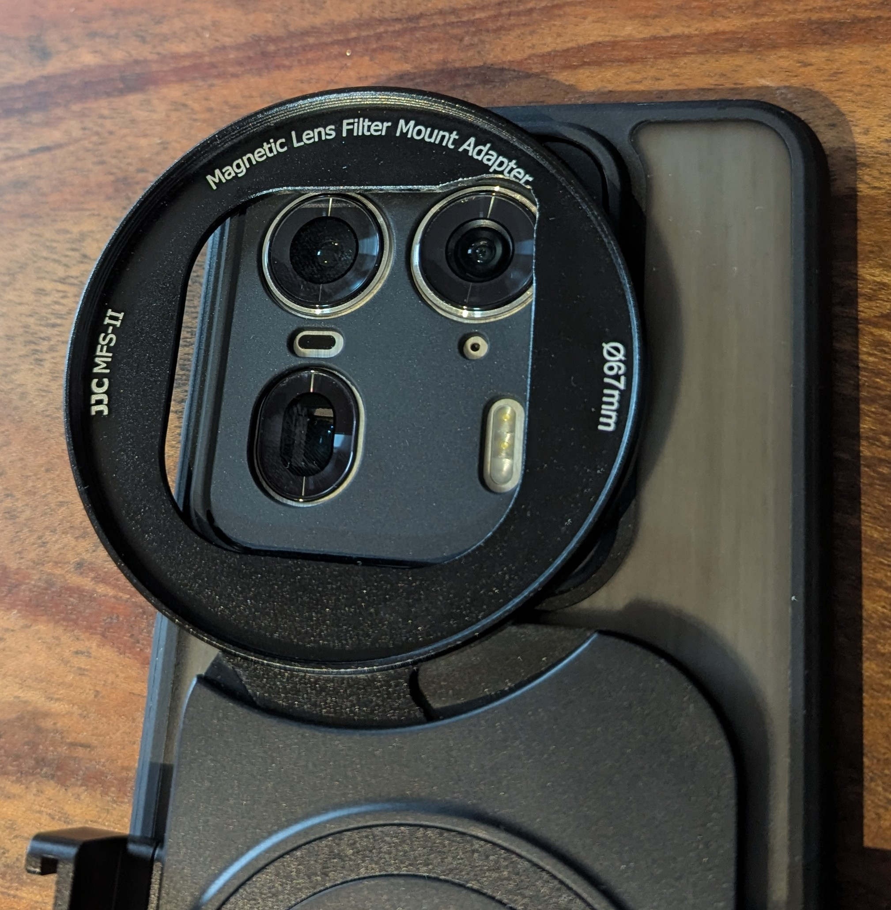

  In addition to the MagSafe mounting system, the adapter also includes a **1/4-inch tripod thread** and a **cold shoe mount**, allowing accessories such as a power bank, USB hub, or wireless microphone receiver to be attached directly. This makes it a very practical building block for compact and flexible mobile video rigs.

  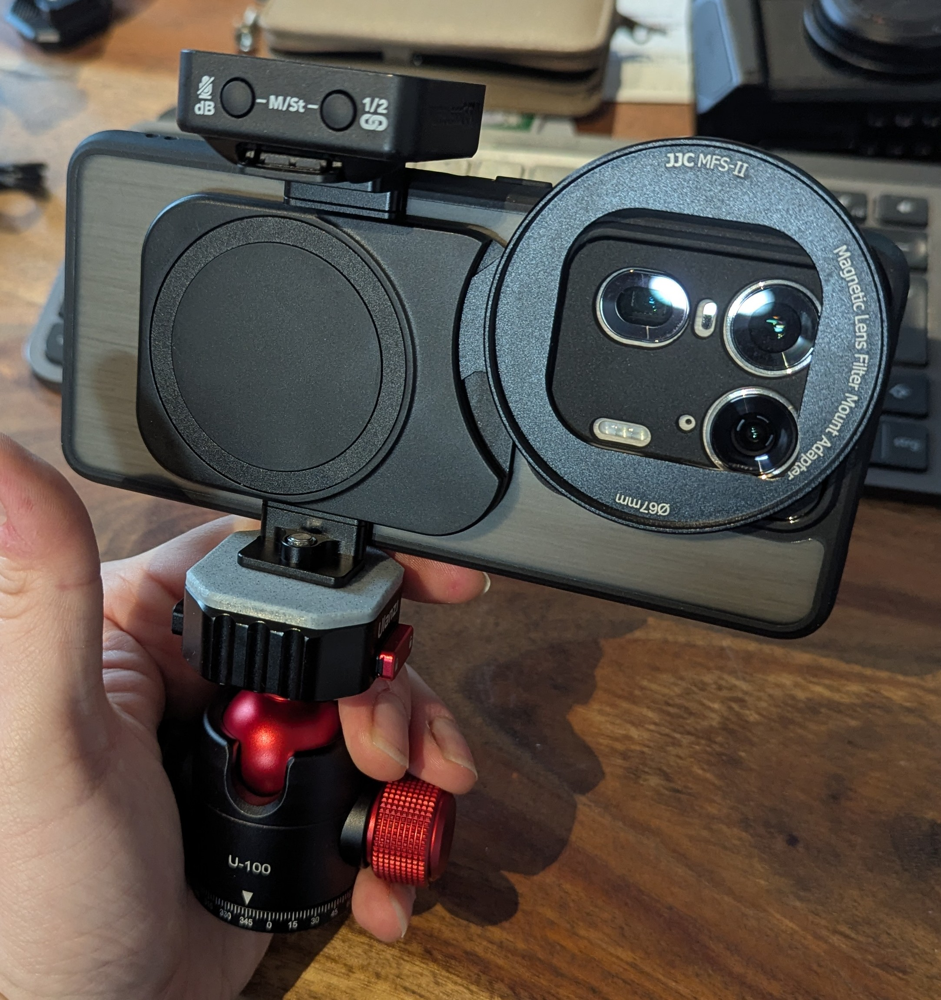

- **[External SSD Case](https://s.click.aliexpress.com/e/_c35GdVX7)** *(**recommended** for RAW recording with MotionCam)*  
  The Motorola Edge 50 Ultra offers up to 1 TB of internal storage, which is more than sufficient for recording RAW video in terms of capacity. So why use an external SSD at all? The reason is reliability. Internal storage on Android devices is shared with the operating system, and certain system processes have higher I/O priority than camera apps. In practice, this can result in short blocking events on the internal filesystem, which are enough to cause dropped frames during high-bandwidth RAW recording.

  Modules like Camera Watchdog reduce background I/O and optimize filesystem behavior, but they cannot completely disable the Android I/O scheduler. To eliminate this remaining risk, it makes sense to record directly to an external SSD that is used exclusively for video capture. This isolates the recording workload and makes the entire capture process significantly more stable.

  I chose the Hagibis SSD case because it combines three useful features in a single unit: an external SSD enclosure, a basic heatsink (the entire housing is aluminum and helps dissipate some heat from the device), and a USB hub. The hub provides two ports: one dedicated to USB Power Delivery for connecting a power bank or charger, and a second port for additional devices such as a wireless microphone receiver.

  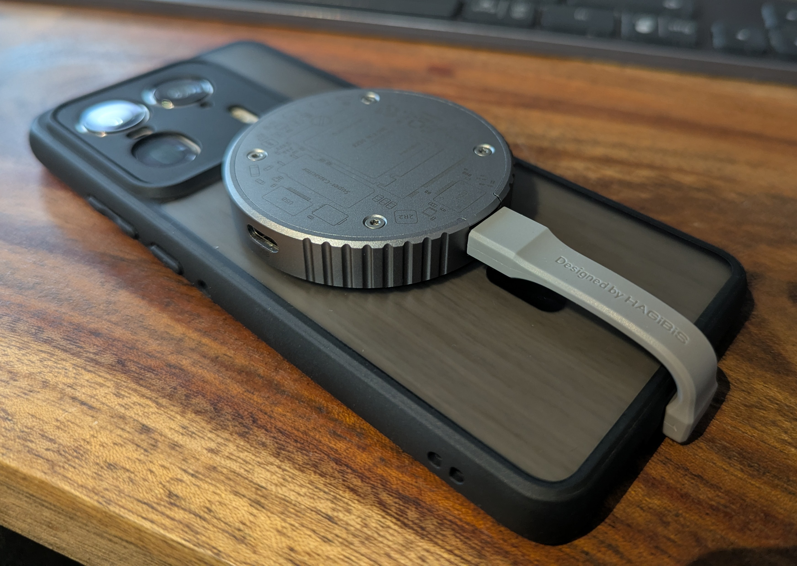

  The enclosure requires an **M.2 2230 SSD** and an **OTG USB cable**. The cables included with the Hagibis case are not compatible with the Motorola Edge 50 Ultra. They work fine with other devices (such as Samsung or Pixel phones), but the Edge 50 Ultra is quite sensitive to USB cable selection. Using a proper OTG cable resolves this issue completely.

  With this setup, I was able to achieve sustained transfer speeds of **over 450 MB/s**, which is more than sufficient even for the most demanding RAW recording modes.
  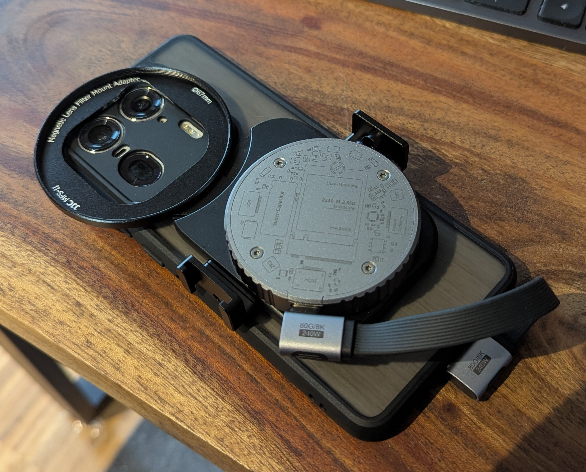

  
- **[WD SN740](https://s.click.aliexpress.com/e/_c3z2z4vj)**  - I chose the WD SN740 because, according to multiple benchmarks, it offers some of the **best sustained write performance** in its class. While peak specifications such as “5000 MB/s read/write” sound impressive on paper, these values are rarely sustainable in real-world scenarios. Many SSDs achieve high peak speeds by relying on fast cache buffers (often a few gigabytes in size). Once this cache is exhausted, write speeds typically drop sharply to the native speed of the NAND flash. In sustained workloads such as RAW video recording, this behavior becomes a critical limitation. In comparative tests, the WD SN740 consistently maintained higher sustained write speeds than competing drives, making it better suited for continuous, high-bandwidth recording. For this reason, it proved to be a reliable choice for external RAW video capture on the Motorola Edge 50 Ultra.
- **Cables** - Since I often prepare my camera setups in advance, I keep a selection of short USB cables (typically **5–15 cm**) on hand. The most important requirement is that the cables support **USB OTG**, which most higher-quality cables do. There is no single cable I would universally recommend; instead, this should be seen as inspiration rather than a strict recommendation. Brands such as **JEYI** and **Hagibis** offer a good selection of short, well-built cables that work well
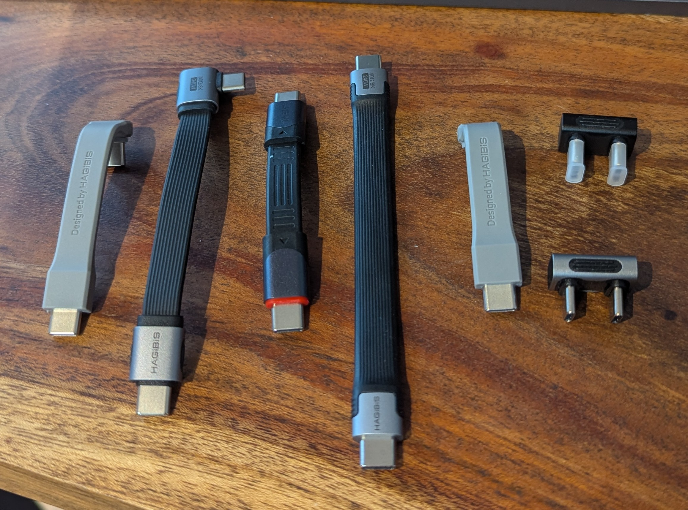
- **[Magnetic Cell Phone Cooler](https://s.click.aliexpress.com/e/_c3FqKnC9)** *(not recommended)*  
  When recording RAW video, the smartphone can become very warm. Since the Edge 50 Ultra uses a vapor chamber and graphene panels to distribute heat internally, I initially hoped that attaching a Peltier-based cooler to the back of the device would meaningfully reduce operating temperatures during recording. In practice, this did not work as expected. The CPU, GPU, and camera module are physically far away from the area where the cooler is mounted on the back of the phone. As a result, there was **no significant temperature difference** at these components with or without the cooler attached, and therefore **no measurable performance improvement** during recording. The only noticeable effect was on battery temperature. In this area, a temperature reduction of approximately **8°C** could be measured. This may have a positive effect on long-term battery longevity, but this is speculative and difficult to quantify. Overall, I do not recommend this cooler for performance or recording stability. It is included here mainly because it is a common accessory that many users will likely come across and consider purchasing.
  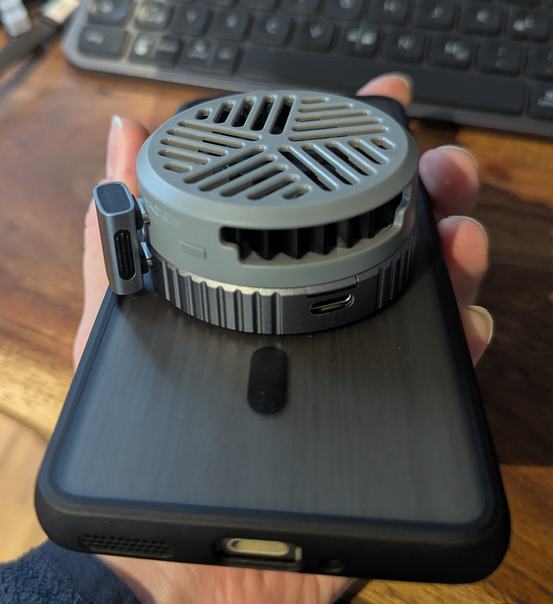
- **[MagSafe Tripod](https://s.click.aliexpress.com/e/_c3fpuICp)** *(must have)*  
  If there is one accessory you should add to a MagSafe-based setup, it is this compact tripod. It is fully machined from aluminum, feels solid, and does not flex or wobble. The integrated **MagSafe mount** allows the phone to be attached and removed instantly, which is ideal for fast setup changes. 
  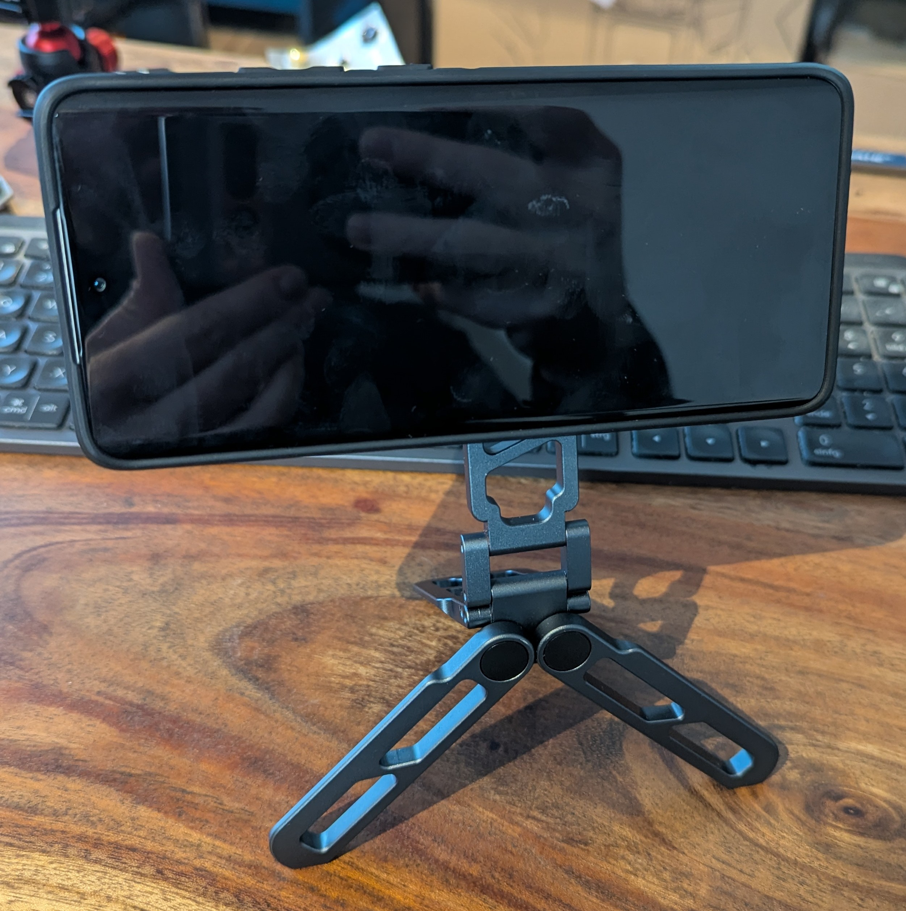
  A major advantage is the built-in **Arca-Swiss interface**, which makes it easy to mount the tripod directly onto any Arca-Swiss compatible system. In addition, it offers multiple **1/4-inch threads**, allowing accessories such as lights to be mounted or the unit to be attached to larger, fixed tripods. 
  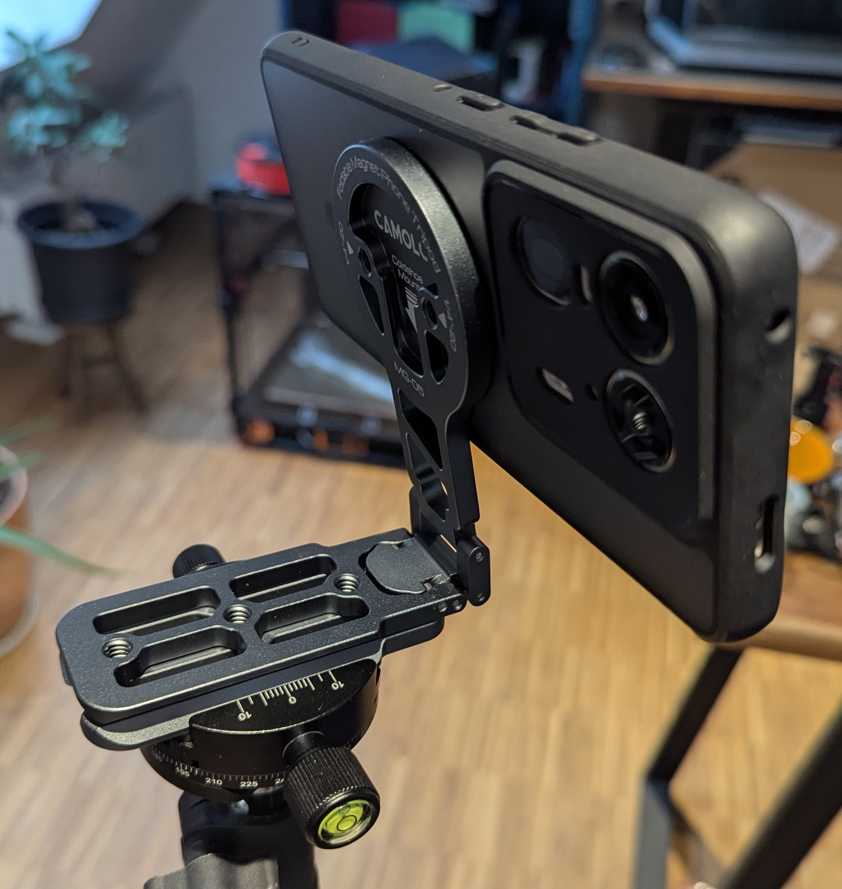
  With this tripod, there is no need to use traditional smartphone clamps anymore. It significantly speeds up setup, improves rigidity, and integrates cleanly into professional tripod and rig systems.
  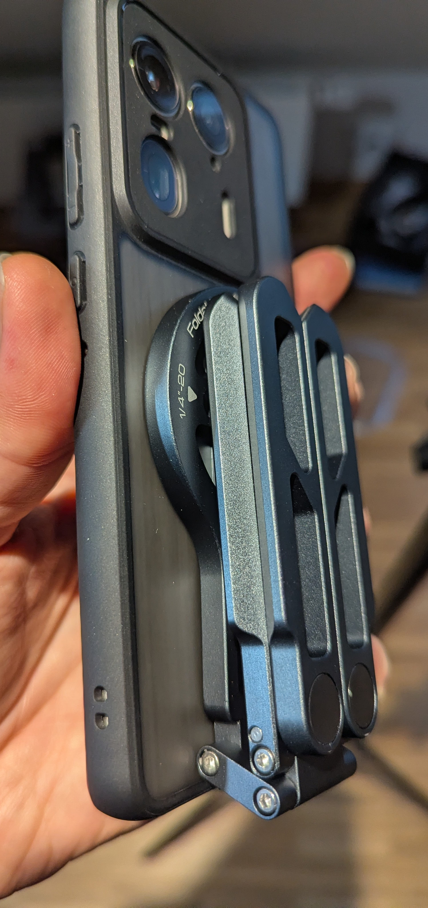

#### What’s still missing / open questions

So far, I have not found a power bank that integrates well with this system. There are some MagSafe power banks available, but in my workflow they are too small to reliably last an entire shooting day without needing a recharge or swap. A few options with cold shoe mounts do exist, but in my experience these tend to be unstable — the power bank can shift in the mount or even fall out.

If you have suggestions for a power bank solution that is large enough for extended shoots and can be mounted securely in a compact rig, I’d love to hear about it!

### Chapter 6 – Recommended Settings

This chapter documents the settings I currently use for video recording. These settings are optimized for stability, predictable behavior, and minimal post-processing effort. They are intended as a reference rather than a universal recommendation and may evolve over time as firmware, apps, or mods change.

#### Android Settings

- Settings->About phone->RAM->Ram boost->deactivate

#### mcpro24fps Settings

The following configuration is what I use when recording Log or DCG-based video with mcpro24fps. The focus is on stable 4K60 recording, consistent exposure, and files that integrate well into a professional post-production workflow.

**General Settings**

Viewfinder:
- EV of scene: On
- Temperature of scene: On
- Safe area: 16:9
- Grid: 3×3

Control:
- AWB autolock: during recording
- AW autolock: during recording
- Maximal zoom: 1.5×

Interface:
- Show information: Codec, Bit, WB, Curve

**Video Settings**
- Resolution: 3840 × 2160 @ 60 fps (without Camera mods)
- Resolution: 4608 × 2592  @ 60 fps (with 4.6K60p active in MTM)
- GPU: Off

Codec:
- Codec: HEVC
- Color depth: 10-bit
- Bitrate: 160 Mb/s or
- Bitrate: 2x160 Mb/s with Bitrate hack enabled.
- Bitrate mode: Constant

Hardware:
- Noise reduction: Off
- Sharpness: Off
- Stabilisation: Optical

Gamut / Color:
- Manual white balance
- A Wide gamut
- mLog-C

Recording:
- manual
- ISO 100-400 for DCG (max ISO 1600 for noisefree videos)
- 1/120

These settings allow recording at **4.6K at 60 fps** when the appropriate mods are installed. If you prefer a more cinematic look, switching to **24 fps** and setting the shutter speed to **1/48** is recommended. This also makes it possible to reduce ISO further, which can help improve overall image quality.

Regarding bitrate, the Motorola Edge 50 Ultra supports a bitrate unlock. While higher bitrates can be enabled, I have not observed a meaningful difference between **160 Mb/s, 250 Mb/s, and 320 Mb/s** at 4.6K 60 fps in practical use. For this reason, I tend to recommend **160 Mb/s** as a pragmatic setting that does not introduce a visible quality compromise while keeping file sizes and system load under control.

At the moment, I am recording in **ARRI Wide Gamut with ARRI LogC3**, and I am still undecided about this choice. I initially settled on LogC3 because it allows me to perform color grading in **DaVinci Resolve using the ARRI color management**, which results in a very intuitive and predictable grading workflow.

One downside of LogC3, however, is that **many colors outside of skin tones are heavily compressed**. Compared to formats like mLog60, noticeably less detail is retained in extreme highlights, such as a blown-out sky. In these situations, **mLog60 preserves highlight detail significantly better**, which makes it an attractive option for studio work or outdoor scenes with high dynamic range.

The drawback of mLog60 is the complexity of grading. Skin tones in particular tend to shift easily and can pick up color casts during grading. To work around this, I would need to apply a **LUT-based transformation from mLog60 to ARRI LogC3** and then perform my grading on top of that. This conversion step is relatively expensive in terms of render performance and also makes the grading workflow feel slower and less responsive overall.

So far, I have not found an optimal solution that combines the highlight retention of mLog60 with the grading efficiency and responsiveness of ARRI LogC3. This is still an open topic in my workflow and will likely evolve over time.

### Chapter 7 – Demo Time

- https://www.youtube.com/watch?v=NOJr4bu0_Kc
- https://www.youtube.com/watch?v=SFImdQAs5PM

### Chapter 8 – Resources

- **[Motorola Edge 50 Ultra | Community on Telegram](https://t.me/MotorolaEdge50Ultra)**  
  This is the primary place to ask device-specific questions, exchange experiences, and connect with other users of the Motorola Edge 50 Ultra. It is usually the fastest way to get practical help related to hardware, firmware, or general usage.

- **[mcpro24fps.english on Telegram](https://t.me/mcpro24fps_en)**  
  This is the main resource for questions related to filming with mcpro24fps. It is well suited for discussing settings, workflows, and app-specific behavior.

- **[MotionCam on Discord](https://discord.gg/Vy4gQNEdNS)**  
  This is the primary place for questions and discussions around MotionCam, especially when working with RAW video, experimental modes, or advanced recording setups.
